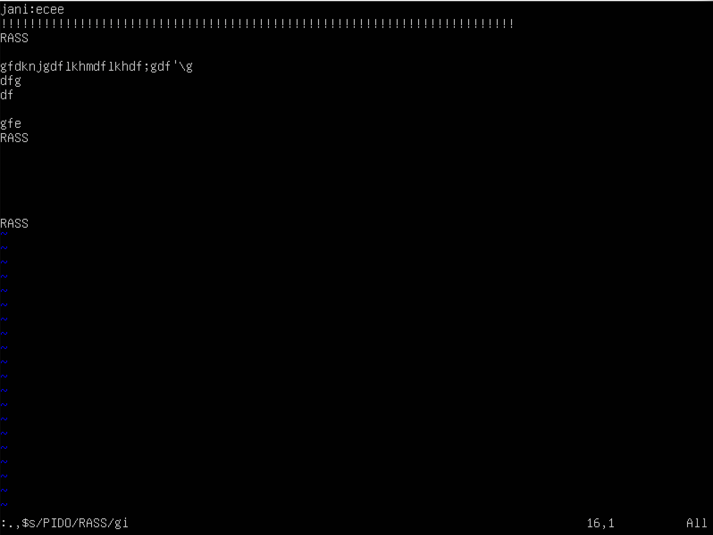

## Part 1. Installation of the OS

Ubuntu Version Info

## Part 2. Creating a user

Add new user 'admin' have permission to read logs from the /var/log folder

Screenshot of the command `cat /etc/passwd` output

## Part 3. Setting up the OS network

Set the machine name as user-1

Set the time zone corresponding to your current location

Output the names of the network interfaces using a console command
*lo:* Occasionally, you will also see the dummy hostname localhost being used instead of the IP-address. ifconfig will look up the name in the hosts file where an entry should declare it as the hostname for 127.0.0.1:
           localhost     127.0.0.1

get the ip address of the device you are working on from the DHCP server
#### DHCP: 
*LFP*
https://unix.stackexchange.com/questions/653063/what-are-lpf-and-socket-fallback-in-the-output-of-dhclient-v

*DHCPREQUEST message*
Ethernet: source=sender's MAC; destination=FF:FF:FF:FF:FF:FF
IP: source=10.0.2.15; destination=255.255.255.255;[a]
UDP: source port=68; destination port=67
XID 0x7ad7c
The next message to be transmitted will be a DHCPREQUEST, which will be broadcast. If no response is heard, the client will bind to its address and move to the BOUND state.

*DHCPACK message*
IP: source=10.0.2.15; destination=255.255.255.255;[a]
UDP: source port=68; destination port=67
XID 0x7ad7c
The server sends a confirmation to the client. SRC IP: 10.0.2.15 DST IP: 255.255.255.255. The options and fields of this packet do not differ from DHCPOFFER, except for the option with the code 53 (DHCP message type) equal to 0x05, which means that this packet is a confirmation from the DHCP server.
https://habr.com/ru/company/dsec/blog/333978/

*bound to 10.0.2.15 -- renewal in 37962 seconds*

default from routel

all from netstat

Set static (manually set, not received from DHCP server) ip, gw, dns settings (use public DNS servers, e.g. 1.1.1.1 or 8.8.8.8)

Reboot

Ping to 1.1.1.1 and ya.ru

## Part 4. OS Update

Update the system packages to the latest version
## Part 5. Using the sudo command

The main purpose of sudo is to execute a command on behalf of another user, usually from root. The point of executing a command from root is that he has elevated access rights and, using sudo, an ordinary user can perform those actions for which he does not have enough rights.

Check sudo (add passwrd admin)

## Part 6. Installing and configuring the time service

sudo timedatectl set-ntp on - command for active NTPSynchronized=yes

## Part 7. Installing and using text editors
#### VIM: https://linuxize.com/post/vim-search/

Install VIM: sudo apt-get install vim

done to exit with the changes saved with command: :wq!

done to exit without saving the changes with command: :q!

find command: /RASS

replace command::.,$/PIDO/RASS/gi

#### NANO: https://tecadmin.net/how-to-search-in-nano/

Install NANO: sudo apt-get install nano

done to exit with the changes saved with command: ^X next y

done to exit without saving the changes with command: ^X next n

find command: ^w next Enter

replace command: ^w next ^r next Enter

#### JOE: https://wiert.me/2016/10/07/installing-the-joe-terminalconsole-text-editor-on-mac-os-x/

Install JOE: sudo apt-get install joe

done to exit with the changes saved with command:^KS Y

done to exit without saving the changes with command: ^KQ

find command: ^KF next R (REPLACE) next N(NO)
replace command: ^KF next R (REPLACE) next Y(YES)

## Part 8. Installing and basic setup of the SSHD service

Install the SSHd service

Add an auto-start of the service whenever the system boots

Reset the SSHd service to port 2022

Show the presence of the sshd process using the ps command
https://andreyex.ru/operacionnaya-sistema-linux/komanda-ps-v-linux/
*Option a* instructs ps to display the processes of all users, except for those processes that are not associated with the terminal and the processes of the leader group.
*The U—stands* for a user-oriented format that provides detailed information about processes.
*The x option* in ps lists processes without a control terminal. Basically, these are processes that run during boot and run in the background.

Reboot the system and run netstat -tan command
https://linuxconfig.org/learning-linux-commands-netstat
-t	Display TCP connections only
-a	Show both listening and non-listening sockets
-n	Show numerical addresses instead of trying to determine symbolic host, port or user names.
https://serverfault.com/questions/78048/whats-the-difference-between-ip-address-0-0-0-0-and-127-0-0-1
When a service is listening on 0.0.0.0 this means the service is listening on all the configured network interfaces, when listening on 127.0.0.1 the service is only bound to the loopback interface (only available on the local machine)

## Part 9. Installing and using the top, htop utilities

#### TOP: https://linux-notes.org/kak-uznat-uptime-v-linux-unix/

uptime, number of authorised users, total system load, total number of processes, cpu load, memory load

pid of the process with the highest memory usage

pid of the process taking the most CPU time

#### HTOP:

sorted by PID

PERCENT_CPU

PERCENT_MEM

TIME

filtered for sshd process

with the syslog process found by searching

with hostname, clock and uptime output added

## Part 10. Using the fdisk utility
https://opensource.com/article/18/9/swap-space-linux-systems

/dev/sda   Sectors= 43675648 Size= 20.8G
Linux swap size= 4G
https://losst.ru/nastrojka-swap-v-ubuntu-16-04

